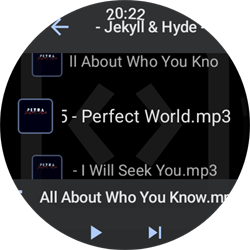

# WatchWare MP3

A full-featured MP3 player app designed specifically for Android based / Wear OS smartwatches.

## Features

- Browse and play audio files directly from your Wear OS device
- Watch-optimized Material Design interface
- Background playback
- Bluetooth headphone controls support
- Album art

## Screenshots

Here's a look at WatchWare MP3 in action:

### Media Browser Screen

The media browser allows you to navigate through your audio files and folders directly on your watch. 

### Player Interface

The player screen features:
- Album artwork that dynamically influences the UI color theme
- Touch-friendly playback controls (play/pause, next, previous)
- Progress slider for easy navigation within tracks
- Automatic fading of controls after period of inactivity for distraction-free viewing

### Advanced Playback Controls

Additional features include:
- Volume control with mute function
- Music visualization options (experimental)
- Optimized for small screen visibility while maintaining full functionality

## Requirements

- Wear OS 3.0 or higher
- Android 9.0+ on the connected phone (for file transfer)
- Minimum of 30MB free storage on your watch
- For optimal experience: Wear OS device with at least 1GB RAM

## Installation

To install WatchWare MP3 on your Wear OS device:

1. Download the latest APK from the [Releases](https://github.com/your-username/watchwareMP3/releases) page

3. Enable ADB debugging on the watch
4. Install using ADB: `adb install -r watchwareMP3.apk`

## Install via ADB
This is currently a bit tricky and still leaves room to be optimized 

1. Download the latest APK from the [Releases](https://github.com/your-username/watchwareMP3/releases) page
2. Enable developer mode on your watch (Settings > System > About > tap Build number 7 times)
3. Enable Wireless Debuggin in developer options
4. Sideload it to your watch using adb. For sideloading from Android, i recommend GeminiMan: https://play.google.com/store/apps/details?id=com.geminiman.wearosmanager&hl=en_US
5. Transfer music to your phone using LocalSend - also required to be sideloaded via adb: https://f-droid.org/de/packages/org.localsend.localsend_app/
6. Manage your music files (sideload via adb): https://f-droid.org/de/packages/com.martinmimigames.simplefileexplorer/

## Support and Donations

If you find WatchWare MP3 useful, please consider supporting its development:

1. **Donate** - Your financial support helps cover development costs and enables new features
2. **Spread the word** - Tell other Wear OS users about this app

Donations directly influence the development. 

## About watchware apps

### From SMART-PHONE to Dumb-PHONE with SMART-watch.

**What?** - Apps for your Android based Smartwatch like Galaxy-/Pixel-/Xiaomi-Watch (Maybe Huawei).\
**Why?** - Use your watch more for whats important and your phone less for what in the end is just stealing time.\
**How?** - Download -> Install -> Use -> Donate back a part of the value you received.\
**Where?** - On Github and not on app stores - freedom for you and me. Making app stores happy takes time and hence takes away from creating value.\
**Motivation?** - Fill the obvious need of standalone apps for watches and therefore working on something of interest and value the way i like and brings best value.\
**The code is bad?** - If it provides value and does not harm security, privacy etc., then it does what it is supposed to. All value driven.\
**What might people hate?** - You might hate that i only invest time and energy where i like or where those like, that support by donations.\
**Where do donations go?** - Donations will cover my costs on all levels. The more donations i get, the more i can work on these projects.\
**Something missing?** - Alot! Of course! - just getting started

## Contact

Feel free to get in touch via email (noted in a cryptic way to prevent spam).\
Send it to my email provider yahoo using the international domain .com with the name d34g13 in front of the '@'.

## License

This project is licensed under the [Creative Commons Attribution-NonCommercial 4.0 International License](LICENSE.md).

This means you are free to:
- Share — copy and redistribute the material in any medium or format
- Adapt — remix, transform, and build upon the material

Under the following terms:
- Attribution — You must give appropriate credit and indicate if changes were made
- NonCommercial — You may not use the material for commercial purposes

See the [LICENSE.md](LICENSE.md) file for full details.
